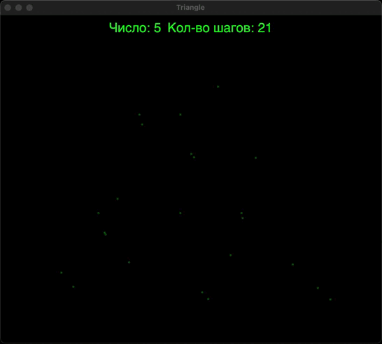

# Эксперимент по генерации точек в треугольнике Серпинского: Исследование теории хаоса

## Введение

Этот эксперимент посвящен исследованию концепций теории хаоса через генерацию случайных точек внутри треугольника Серпинского. Мы использовали простые правила, основанные на случайности, чтобы продемонстрировать, как хаотические процессы могут приводить к сложным и интересным визуальным результатам.

## Условия эксперимента

1. **Определение треугольника Серпинского**: Мы задали три вершины треугольника:
   - Верхняя вершина (0.5, 1)
   - Левая нижняя вершина (0, 0)
   - Правая нижняя вершина (1, 0)

2. **Метод генерации точек**: На каждом шаге генерировалось случайное число от 1 до 6. Это число определяло, к какой из трех вершин мы будем "приближаться" для генерации новой точки:
   - **Числа 1-2**: Новая точка располагается посередине между текущей точкой и верхней вершиной.
   - **Числа 3-4**: Новая точка располагается посередине между текущей точкой и левой нижней вершиной.
   - **Числа 5-6**: Новая точка располагается посередине между текущей точкой и правой нижней вершиной.

3. **Количество итераций**: Процесс повторялся 5000 раз, что позволяло наблюдать, как распределение точек формируется внутри треугольника Серпинского.

## Результаты

Видео ускорено в 50 раз:

По завершении эксперимента на графике была видна сложная структура, представляющая собой заполнение треугольника точками. Этот визуальный результат иллюстрирует явление, известное как "фрактальная геометрия", где простые правила приводят к сложным формам, как в случае с треугольником Серпинского.

## Обсуждение

Эксперимент показывает, как хаотические процессы могут создавать порядок из случайности. Генерация точек в треугольнике Серпинского является ярким примером того, как маленькие изменения в начальных условиях могут привести к неожиданным и интересным результатам. 

Мы увидели, что, несмотря на простоту используемых правил, получившееся распределение точек имеет фрактальную природу, характерную для треугольника Серпинского, что делает его идеальным объектом для изучения в контексте теории хаоса.

## Заключение

Данный эксперимент демонстрирует принципы теории хаоса и фрактальной геометрии, подчеркивая важность случайности в формировании сложных структур. Это исследование открывает двери для дальнейшего изучения хаотических систем и их приложений в различных областях науки.
